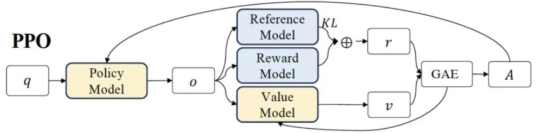

# 📌 强化学习

## 📌 PPO

<!-- 
 -->
### 基本概念
    Agent在State下选择Action ->Enviroment返回新的State和Reward ->循环直到终止。强化学习的核心目标是让智能体通过与环境交互学习到最优策略，以最大化长期累积奖励（回报）

Agent
 
学习与决策的主体，通过与环境交互获得经验，最大化长期奖励

State

环境在特定时刻的描述
在LLM中，state通常表示模型在生成过程中某一时间步的上下文信息，包括Prompt+生成部分

Action

智能体在状态下的行为
在LLM中，Action通常指模型在特定state下生成的下一个token

Reward

奖励信号，当前状态下采取某个动作的好坏（即对奖励模型对LLM输出好坏的整体评价）

Policy

策略函数，一个状态映射到动作的函数。即输入State，输出Action的概率分布。（指的是LLM本身）一般用<code>Π</code>表示。

### 公式推导
    在强化学习中，累计奖励最大目标是希望Agent与环境不断交互，学习到一个最优策略，从而在长期内获得尽可能多的奖励。然而由于环境的随机性和不确定性，每次交互的结果（即累计的总奖励）可能不相同。因此我们追求的是在长期交互中累计奖励的平均效果最大化，这就是**最大化期望累计奖励**。

期望

期望表示每个可能结果的概率预期结果的值的乘积之和。它反映了随机变量在大量重复实验中可能取值的加权平均值。

--对于离散随机变量：
$$
E[X] = \sum_{i} x_i \cdot P(X = x_i)
$$
--对于连续随机变量：
$$
E[X] = \int_{-\infty}^{+\infty} x \cdot f_X(x)\, dx
$$

RL目标

训练一个Policy神经网络 $\pi$ ，在所有状态下给出相应的Action，得到的return期望最大：

$$
E(R(\tau))_{\tau \sim P_\theta(\tau)} = \sum_{\tau} R(\tau) P_\theta(\tau)
$$

公式的含义：希望通过调整策略参数 $\theta$，使得在策略 $\pi_\theta$ 下生成的所有可能轨迹 $\tau$ 的期望回报 $R(\tau)$ 最大化

$\pi_\theta$（策略）：表示当前语言模型，其参数为$\theta$。该模型根据输入prompt生成回复，即在每个状态下选择下一个token的概率分布

$\tau$（轨迹）：表示模型在生成回复过程中的一系列状态和动作序列。例如，从接收一个prompt开始，模型依次生成多个token，直到形成完整的回复。

$P_\theta(\tau)$（轨迹的概率）：表示在策略下生成额定轨迹的概率

$R(\tau)$（轨迹的回报）：表示轨迹的总奖励

$E(R(\tau))$：表示随机变量 $R(\tau)$ 的期望值。

$\tau \sim P_\theta(\tau)$：表示 $\tau$ 是一个随机 Trajectory，其分布由参数为 $\theta$ 的概率分布 $P_\theta(\tau)$ 给出。

$R(\tau)$：表示与随机变量 $\tau$ 相关的某个函数或奖励。

$P_\theta(\tau)$：表示随机变量 $\tau$ 的概率分布，依赖于参数 $\theta$。

损失函数

